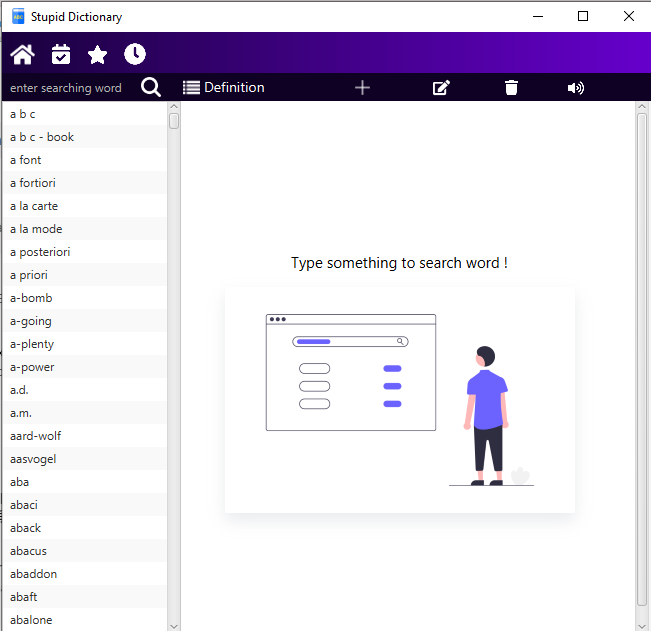
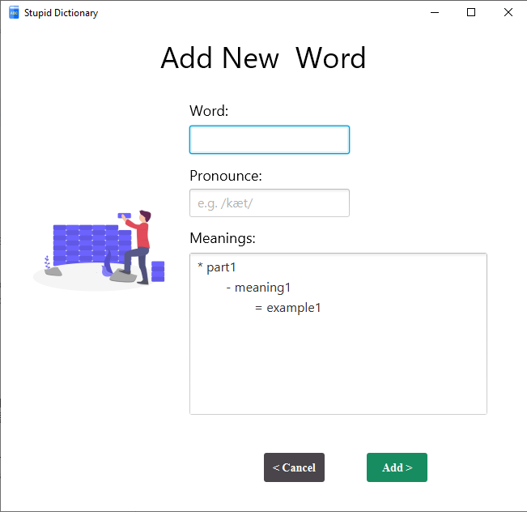
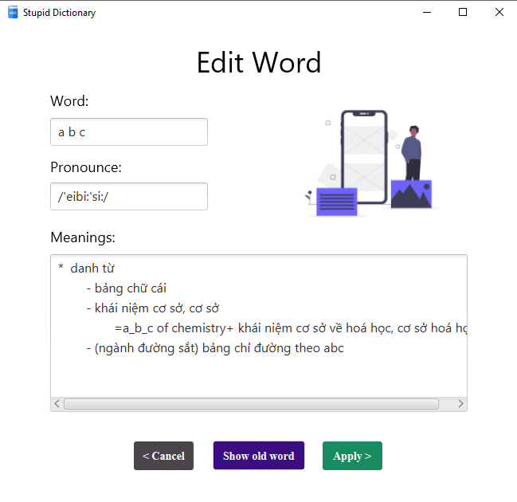

# JavaFx Dictionary
A dictinary build with JavaFx and MySQL

---

### Feature
- Search meaning, pronounce, related words 
- Delete, update word
- Speech word

### Techs

This project use some of technology:

- [JavaFx](https://openjfx.io/) - Using to design application
- [FreeTTS](https://freetts.sourceforge.io/) - A free open-source to change text to speech 
- [SceneBuilder](https://gluonhq.com/products/scene-builder/) - Drag & Drop, Rapid Application Development.
- [FreeSQLDatabase](https://www.freesqldatabase.com/account/) - A free database to store data on cloud
- [IntellijIDEA](https://www.jetbrains.com/idea/) - Amazing Java IDE

### Demo

---

## License
MIT
